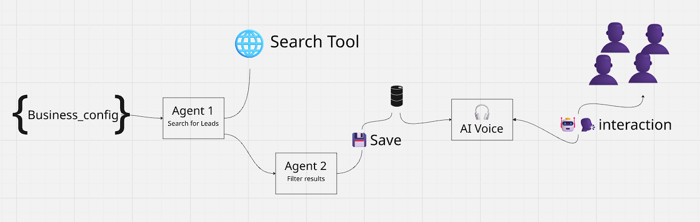

# 💎 GEMSELL – AI Sales Assistant Platform

An AI-powered B2B lead generation platform built during **NCS HACK 2.0** by **Team 1CS3AI**.  
GEMSELL combines intelligent web scraping, voice interaction, and real-time dashboards to help startups and freelancers find qualified business leads instantly.

---

## 👨‍💻 Who Are We?

We are **Team 1CS3AI**, a group of final-year AI and cybersecurity students passionate about solving real-world problems using cutting-edge technologies. GEMSELL is our vision of empowering young entrepreneurs with intelligent, accessible sales tools.

---

## ❗ Problem Statement

Meet Ziad — a freshly graduated student from Qatar. He has a brilliant product idea but no connections or tools to identify real clients. Each day he wastes hours manually Googling vague keywords and scraping emails from outdated websites — often with zero results.

Thousands of solo founders and junior sales teams share Ziad’s struggle:
- Lead discovery is time-consuming and inefficient
- Most websites hide or obscure contact info
- Existing tools are too expensive or don't work for local markets

---

## ✅ Proposed Solution: GEMSELL

GEMSELL is a full-stack platform that automates:
- **AI-driven lead discovery** using Google Search & scraping
- **Smart contact info extraction** (emails, phones, niche)
- **Voice-based AI sales assistant** to engage with leads
- **Live dashboard** for ranking and tracking lead quality
- **Mobile app** for on-the-go notifications and outreach

> “From query to contact — in less than 30 seconds.”

---

## 🎨 Screenshots & Mockups

### 💡 Landing Page


### 📊 Dashboard UI


### 📥 Leads Page


---

## 🧠 System Architecture



> The system has three key components:
1. **Web & Mobile UI** – Where users interact with the AI and view leads.
2. **AI Backend** – Powered by Python, FastAPI, Gemini, and LangChain for smart query generation and scraping.
3. **Voice Agent** – Simulates human-like outreach using Gemini’s language models.

---

## 🚀 Features

- 🌐 **Web Scraping + Google Search (Serper API)**
- 🎯 **AI-Analyzed Lead Structuring & Scoring**
- 🧠 **Real-Time Voice Interaction Agent**
- 📊 **Live Dashboard + Campaign Analytics**
- 📱 **Flutter Mobile App with Notifications**
- ⚙️ **Business Profile Customization**
- 📤 **Exportable Leads in JSON Format**

---

## ⚙️ Tech Stack

| Layer       | Technology Used                                         |
|-------------|----------------------------------------------------------|
| **Frontend**| HTML, CSS, JavaScript, Chart.js                          |
| **Backend** | Python, FastAPI, LangChain, Google Gemini, BeautifulSoup |
| **Voice AI**| PyAudio + Gemini Voice Streaming                         |
| **Mobile**  | Flutter/Dart + Firebase                                  |
| **Other**   | Serper API, Regex, WebSockets (aiohttp)                  |

---

## 🔧 Getting Started

### 1. Clone the Repo
```bash
git clone https://github.com/yourusername/GEMSELL.git
cd GEMSELL
```

### 2.Backend (Python + FastAPI)
```bash
cd Backend
python -m venv venv
source venv/bin/activate   # Or use venv\Scripts\activate on Windows
pip install -r requirements.txt
cp .env.example .env       # Add your Serper and Gemini API keys
python agent.py
```

### 3.Frontend (Web)
Just open:
```bash
Frontend/website/landing.html
Frontend/website/Dashboard.html
```
Or serve it using a static web server.

### 4.Mobile App (Flutter)
```bash
cd Mobile
flutter pub get
flutter run
```

###🔌 API Endpoints
| Endpoint            | Purpose                              |
| ------------------- | ------------------------------------ |
| `/ranked-leads`     | Get filtered + structured leads      |
| `/dashboard-data`   | Get campaign stats                   |
| `/run-agent-stream` | Start real-time Gemini-powered agent |
| `/config`           | Get or update business config        |

###🔧 Customization
Edit business_config.json with:

Target region

Industry keywords

Language preferences

Add your API keys in .env

Customize frontend look & feel via HTML/CSS

###🔭 Future Work
📞 Real outbound voice calls using Twilio or SIP, powered by our AI voice agent.

###🤝 Contributing
Want to help us grow GEMSELL?
Pull requests and issue reports are always welcome!

###🪪 License
This project is released under the MIT License.
See LICENSE file for details.

###🧠 Team 1CS3AI (NCS HACK 2.0 Finalists)
💼 Benmati Ziad 
💻 Bouzekri Mohamed
📱 Abdi Fares
🎨 Zobir Ahmed Abderaouf

Built with 💙 during NCS HACK 2.0 – July 2025
